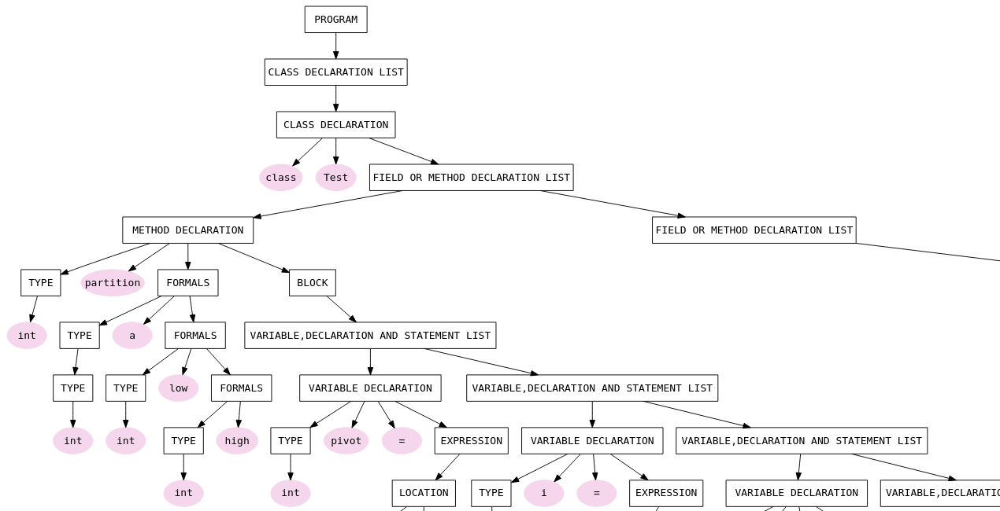

                                             
# A miniJava compiler: First part

This project was written in python using the PLY (Python Lex-Yacc) library. You can find a complete description of PLY with examples [here](http://www.dabeaz.com/ply/) 
                                                                                
This [document](miniJavaRules.pdf) contains the specifications for the miniJava language. It's in spanish, though.                              
                                                                                                                                                                

There are three folders                                                         
                                                                                
## Lexical                                                                    
A lexical analyzer for tokens.                               
                                                                                
## Syntactic                                                                   
A syntactic analyzer which parses a program written in miniJava and prints in the console an abstract syntax tree.
                                                                                
## SyntacticDOTcode                                                            
Its the same as before, but now the analyzer outputs a file with the abstract syntanx tree in DOT code. You could grab the DOT code, and paste it in a website such as http://webgraphviz.com/ to create a pretty drawing of an abstrat syntax tree. 

See this example:

